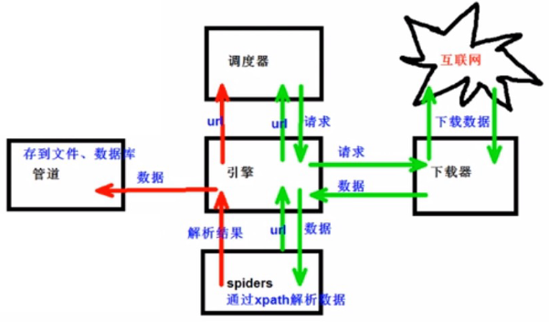

## 爬虫基本知识

### 1.xpath

### 2.JsonPath

```
jsonpath的安须及使用方式:
pip安装:


pip install jsonpath


jsonpath的使用:
obj = json.load(open("json文件”，"r”, encoding 'utf-8'))
ret = jsonpath.isonpath(obj，“jsonpath语法')
收程连授(htto/blox.csdn.netuxidevao/article/details/77802389)

练习淘票票
作业:1.股票信息提取 (http://quore.stockstar.com/)
2.boos直聘
3.中华英才
4.汽车之家
```


### 3.BeautifulSoup

1.简介

```
1.Beautifulsoup简称bs4
2.什么是Beatifulsoup?
Beautifulsoup，和1xml一样，是一个html的释折器，主要功能也导解析和提取数据

3.优缺点?
缺点:效率没有lxml的效率高
优气:接口设计人性化，使用方便
```

2,安装以及创建

```
1.安装
pip install bs4
2.导入
from bs4 import Beautifulsoup
3.创建对象
服务器响应的文件生成对象
soup = Beautifulsoup(response.read().decode()，"1xm1')本地文件生成对象
soup = Beautifulsoup(open('1.htmi'),'lxml')注意;默认打开文件的编巧格式gbk所以需要指定打开编码格式
```

3.节点定位

```
1.根据标签名查找节点
soup.a [注] 只能找到第一个a
soup.a.name
soup.a.attrs
2.函数
	（1）.find（返回一个对象）
    find('a'):只找到第一个a标签
    find('a', title=‘名字'）
    find('a', class=‘名字'）
（2）.find_a11（返回一个列表）
  find_al1('a') 直找到所有的a
  find_all(['a'，'span']) 返回所有的a和spanfind_al1('a'，1imit=2) 只找前两个a
  （3）.select（根据选择器得到节点对象）【推荐】
  1. element
    eg: p
  2. class
    eg: .firstname
  3. #id
    eg: #firstname
4.属性性选择器
	[attribute]
		eg:li = soup. select('li[class]')
	[attribute=value]
		eg:li = soup. select ('li [class="hengheng1"]')
5.层级选择器
	element element
		div p
	element>element
		div>p 
	element, element
		div,p
	eg: soup = soup. select ('a, span')
```

4.节点信息

```
（1）.获取节点内容：适用于标签中嵌套标签的结构
  obj.string
  obj.get_text()【推荐】
```

### 4.selenium

1. 什么是selenium？

2. 为什么使用selenium？

模拟浏览器功能，自动执行网页中的js代码，实现动态加载

3. 如何安装selenium？

（1）换作谷歇浏览器驱动下载地址

http://chromedriver.storage.googleapis.com/index.html

（2）谷歌驱动和谷歇浏览器版本之间的映射表

http://blog.csdn.net/huilan_same/article/details/51896672

（3） 查看谷歇浏览器版本

谷歌浏览器右上角 ->帮助-->关于

(4) pip install selenium

4. selenium的使用步骤？

```
(1) 导入: from selenium import webdriver
(2) 创建谷歌浏览器操作对象：
path = 谷歌浏览器驱动文件路径
browser = webdriver .Chrome(path)
(3) 访问网址
ur1 = 要访问的网址
browser.get(url)
```

4-1: selenium的元素定位？

元素定位：自动化要做的就是模拟鼠标和键盘来操作来操作这些元素，点击、输入等等。操作这些元素前首先

要找到它们，webDriver提供很多定位元素的方法

方法：

```

1. find_element_by_id
	eg: button = browser.find_element_by_id('su')
2. find_elements_by_name
	eg: name = browser.find_element_by_name('wd')
3. find_elements_by_xpath
	eg: xpath1 = browser.find_elements_by_xpath('//input[@id="su"]')
4. find_elements_by_tag_name
	eg:names = browser.find_elements_by_tag_name('input')
5. find_elements_by_css_selector
	eg:my_input = browser.find_elements_by_css_selector ('#kw')[0]
6.find_elements_by_link_text
	eg:browser. find_element_by_link_text ("#Fil")


```

4-2：访问元素信息

```
获取元素厲性
	.get_attribute('class')
获取元素文本
	.text
获取标签名
	.tag_name
```

4-3：交互

```python
点击：click()
輸入：send_keys()
后退操作：browser.back()
前进操作：browser.forword()模拟JS滚动：
js = document. documentElement. scrollTop=100000'
browser.execute_script（js）执行js代码获取网页代码：page_source
退出：browser.quit()
```

2.Phantomjs

1. 什么是Phantomjs？

   ```
   （1）是一个无界面的浏览器
   （2）支持页面元素查找，js的执行等
   （3）由于不进行css和gui渲染，运行效率要比真实的浏览器要快很多
   ```

   

2. 如何使用Phantomjs？

   ```
   (1) 获取PhantomJS.exe文件路径path
   (2) browser = webdriver.PhantomJS(path)
   (3) browser.get(url)
   扩展：保存屏幕快照：browser.save_screenshot('baidu.png')
   ```

   

3.Chrome handless

```
1.系统要求：
  Chrome
		Unix/Linux 系統需要 chrome >= 59
		windows 系统需要 chrome >= 60

	Python3.6
	Selenium==3.4. *
	ChromeDriver==2.31
```


```
2.配置：
from selenium import webdriver
from selenium.webdriver.chrome.options import Options

# 创建 ChromeOptions 对象
chrome_options = Options()

# 设置 Chrome 以无头模式启动
chrome_options.add_argument('--headless')
chrome_options.add_argument('--disable-gpu')  # 禁用 GPU 加速

# 创建 Chrome WebDriver 对象，传入 ChromeOptions 对象
browser = webdriver.Chrome(options=chrome_options)

# 访问网页示例（这里访问百度）
browser.get('http://www.baidu.com/')
```

### requests

1.基本使用

```
1.文档：
	官方文档
http://cn.python-requests.org/zh_CN/latest/
	快速上手
http://cn.python-requests.org/zh_CN/latest/user/quickstart.html
```

2.安装

```
pip install requests
```

3.response的属性性以及类型

| 类型          | : models.Response    |
| ------------- | -------------------- |
| r.text        | ：获取网站源码       |
| r.encoding    | ：访问或定制编码方式 |
| r.url         | ：获取请求的ur1      |
| r.content     | ：响应的字节类型     |
| r.status_code | ：响应的状态码       |
| r.headers     | ：响应的头信息       |


2.get请求

```python
requests.get() 
	eg:
		import requests
		url = 'http://www.baidu.com/s?'
		data = {
    	'wd': '北京'
		}
		headers = {
    	'User-Agent': 'Mozilla/5.0 (Macintosh; Intel Mac OS X 10_15_7) AppleWebKit/537.36 (KHTML, like Gecko) Chrome/123.0.0.0 Safari/537.36',
	}
		response = requests.get(url=url, params=data, headers=headers)
# 总结：
# 参数使用params传递
# 参数无需urlencode编码
# 不需要请求对象的定制
# 请求资源路径中的？可以加也可以不加
```

3.post清求

```
requests.post()
百度翻译：
eg:
import requests
post_url = 'http://fanyi.baidu.com/sug'
headers={
	'User-Agent': 'Mozilla/5.0 (Windows NT 10.0; Win64; x64) AppleWebkit/537.36 (KHTML, like Gecko) Chrome/68.0.3440.106 Safari/537.36'
}
data = {
	'kw': 'eye'
} 
r = requests.post(url = post_ur1, headers=headers,data=data)
```


> get和post区別？
>
> 1: get清求的参数名字是params post清求的参数的名字是data
>
> 2： 请求资源路径后面可以不加？
>
> 3： 不需要手动编解码
>
> 4： 不需要做请求对象的定制

4.代理

```

```


## 1.scrapy

### 1.scrapy简介

（1）scrapy是什么？

Scrapy是一个为了爬取网站数据，提取结构性数据而编写的应用框架。可以应用在包括数据挖

掘，信息处理或存储历史数据等一系列的程序中。

（2） 安装scrapy：

```
pip install scrapy
安装过程中出错：
	如果安装有错误！！！！
	pip install Scrapy
	building 'twisted.test.raiser' extension
	error: Microsoft Visual C++ 14.0 is required. Get it with "Microsoft Visual C++ Build Tools": http://landinghub.visualstudio.com/visual-cpp-build-tools

解决方案：
	http://www.1fd.uci.edu/~gohlke/pythonlibs/#twisted
	下载twisted对应版本的wh1文件（如我的Twisted-17.5.0-cp36-cp36m-win_amd64.wh1），cp
后面是python版本，amd64代表64位，运行命令：
	pip install C: \Users\... \Twisted-17.5.0-cp36-cp36m-win_amd64.wh1
	pip install Scrapy
如果再报错
	python -m pip install --upgrade pip
如果再报错 win32
	pip install pypypiwin32
	
配置环境变量
# scrapy
export PATH=/Users/adam/Library/Python/3.9/bin/scrapy:$PATH
```

### 2.scrapy项目的创建以及运行

1.创建scrapy项目：
 	终端输入

```
scrapy startproject 項目名称
```

2.项目组成：

```

 |--spiders
 |----__init__.py
 |----自定义的爬虫文件.py # 由我们自己创建，是实现爬虫核心功能的文件
 |--__init__.py
 |--middlewares.py # 中间件 代理
 |--settings.py #配置文件 比如：是否遵守robots协议，User-Agent定义等
 |--items.py  # 定义数据结构的地方，是一个继承自scrapy.Item的类
 |--pipelines.py # 管道文件，里面只有一个类，用于处理下载数据的后续处理
   									默认是300优先级，值越小优先级越高（1-1000）
 |scrapy.cfg

```

3.创建爬虫文件：

```
（1）跳转到spiders文件夹 cd 目录名字/目录名字/spiders
（2） scrapy genspider 爬虫名字 网页的域名
 爬虫文件的基本组成：
 		继承scrapy.Spider类
 			name = 'baidu' -> 运行爬虫文件时使用的名字
 			allowed_domains -> 爬虫允许的域名，在爬取的时候，如果不是此域名之下的

url，会被过滤掉
	start_urls -—-> 声明了爬虫的起始地址，可以写多个url，一般是一个
	parse(self,response)---> 解析数据的回调函数
	response. text--->响应的是字符串
	response. body --->响应的是二进制文件
	response.xpath()->xpath方法的返回值类型是selector列表
(3) 运行爬虫代码
    scrapy crawl 爬虫的名字
    eg : scrapy crawl baidu 
```


### 3.scrapy架构組成

```
(1) 引擎	--->自动运行，无需关注，会自动组织所有的请求对象，分发给下载器
(2) 下载器	--->从引警处获取到请求对象后，请求数据
(3) spiders	--->spider类定义了如何爬取某个(或某些)网站。包括了爬取的动作(例如:是否跟进链接)以及如何从网页的内容中提取结构化数据(爬取item)。 换句话说，Spider就是您定义爬取的动作及分析某个网页(或者是有些网页)的地方。
(4) 调度器	--->有自己的调度规则，无需关注
(5) 管道 (Item pipeline)	--->最终处理数据的管道，会预留接口供我们处理数据
当Item在Spider中被收集之后，它将会被传递到item Pipeline，一些组件会按照一定的顺序执行对Item的处理。每个item pipeline组件(有时称之为“Item Pipeline”)是实现了简单方法的python类。他们接收到item并通过它执行一些行为，同时也决定此item是否继续通过pipeline，或是被丢弃而不再进行处理。
以下是item pipeline的一些典型应用:
1.清理HTML数据
2.验证爬取的数据(检查item包含某些字段)
3.查重(并丢弃)
4.将爬取结果保存到数据库中

```


### 4.scrapy工作原理

```
1、引擎向spiders要url
2、引擎将要爬取的url给调度器
3、调度器会将url生成请求对象放入到指定的队列中
4、从队列中出队一个请求
5、引擎将请求交给下载器进行处理
6、下载器发这请求获取互联网数据
7、下载器将教据返回给引擎
8、引擎将数据再次给到spiders
9、spiders通过xpath解析该数据，得到数据或有url
10、spiders将数据或者url给到引擎
11、引擎判断是数据还是url，是数据交给管道(item pipeline)处理，是url交给调度器处理
```



## 2.scrapy shell

1.什么是scrapy shel1?
	Scrapy终端，是一个交互终端，供您在未启动spider的情况下尝试及调试您的爬取代码。 其本意是用来测试提取数据的代码，不过您可以将其作为正常的Python终端，在上面测试任何的Python代码。亥终端是用来测试XPath或(SS表达式，查看他们的工作方式及从爬取的网页中提取的数据。在编写您的spider时，该终端提供了交互性测试您的表达式代码的功能，免去了每次修改后运行spider的麻烦。

一旦熟悉了scrapy终端后，您会发现其在开发和调试spider时发挥的巨大作用。
2.安装ipython
	安装: 

```
pip install ipython
```

简介:如果您安装了IPython ，scrapy终端将使用 IPython (替代标准Python终端)。 IPython终端与其他相比更为强大，提供智能的自动补全，高亮输出，及其他特性。

3.应用:

```
(1) scrapy shell www.baidu.com
(2) scrapy shel1 http://www.baidu.com
(3) scrapy shell "http://www.baidu.com"
(4) scrapy shell "www.baidu.com"
语法:
(1) response对象:
	response.bodyres
	ponse.textresponse.ur1
	response. status
(2) response的解析:
	response.xpath() (常用)
		使用xpath路径查询特定元素，返回一个selector列表对象
```


## 3.yield

## 4.Mysal

## 5.pymysql的使用步骤

## 6.CrawlSpider

## 7.CrawlSpider案例

## 8.数据入库

## 9.日志信息和日志等级

## 10.Request和response总结

## 11.scrapyBpost清求

## 12.代理


今日任务：

- 
- 
